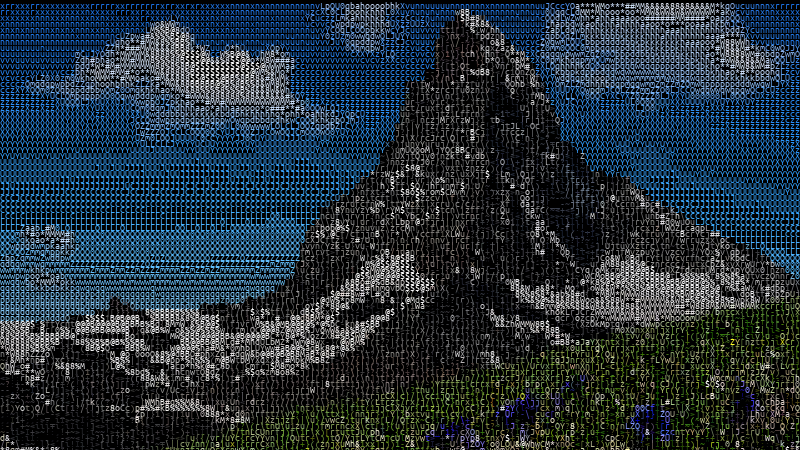

# Mosaiic

This is just a Python image-to-ASCII-based-mosaic generator, with some customizable options.



## Requirements
Only [Pillow](https://pillow.readthedocs.io/en/3.0.x/index.html) is required. A ```requirements.txt``` file is provided.

If you use this under Linux, make sure ```libfreetype6-dev``` is available in your system so Pillow can use truetype fonts. For apt-based distros, use:

```
sudo apt-get install libfreetype6-dev
```

## Usage

```
./mosaiic  --input-image INPUT_IMAGE   Input image file
          [--font FONT.ttf]            Font typeset file (default to Ubuntu Monospace)
          [--font-size N]              Font size in pt (default = 18)
          [--bg R G B]                 Background RGB color. Default to black
          [--fg R G G]                 Foreground RGB color. If unspecified, will color chars with image values.
          [--scale X]                  Output rescale (default = 1.0)
           --output OUTPUT_IMAGE       Output ASCII mosaic
```